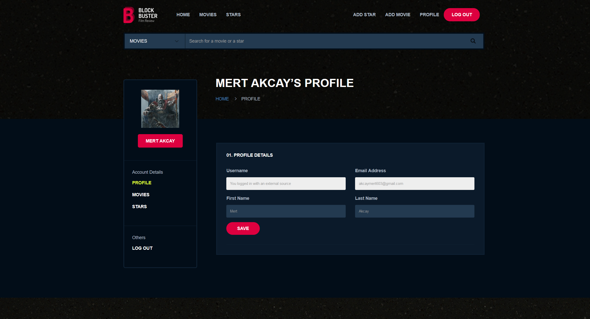
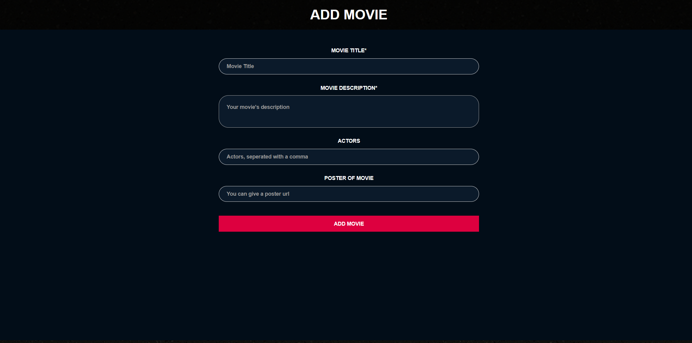
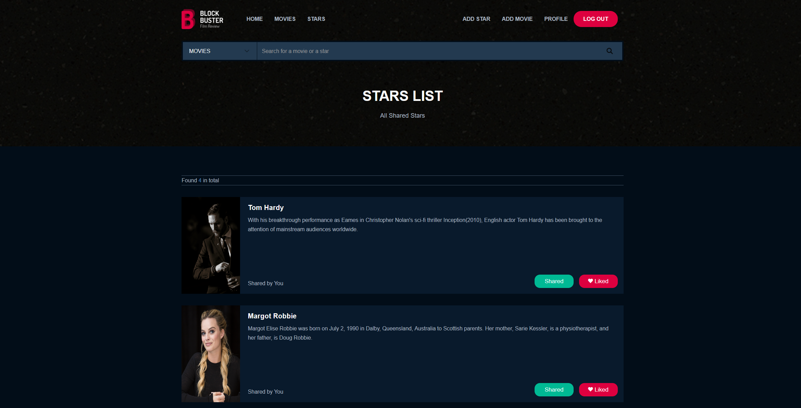

<div id="top"></div>


<br />
<div align="center">

  
  <h2 align="center">Block Buster Film Review</h2>

</div>

  


<details>
  <summary>Table of Contents</summary>
  <ol>
    <li>
      <a href="#about-the-project">About The Project</a>
      <ul>
        <li><a href="#built-with">Built With</a></li>
      </ul>
    </li>
    <li>
      <a href="#getting-started">Getting Started</a>
      <ul>
        <li><a href="#installation">Installation</a></li>
      </ul>
    </li>
    <li><a href="#usage">Usage</a></li>
    <li><a href="#license">License</a></li>
    <li><a href="#contact">Contact</a></li>
  </ol>
</details>


<br>

## About The Project


This project has been created as graduation project of NodeJS Bootcamp that's been prepared by Gusto&RemoteTeam and Patika.dev.

Here's an outline of the scope of this project :
* Sign-up system for new users
* Local, Facebook and Google Login System
* Adding new movies and stars
* Sharing movies and stars
* Like, review and delete movies and stars


<p align="right">(<a href="#top">back to top</a>)</p>


### Built With

MVC Architecture has been used for this project. Some major technologies that's been used are listed below

* [TypeScript](https://www.typescriptlang.org/)
* [MySQL](https://www.mysql.com/)
* [TypeORM](https://typeorm.io/)
* [ClearDB](https://devcenter.heroku.com/articles/cleardb)
* [JWT](https://jwt.io/)
* [JQuery](https://jquery.com/)


<p align="right">(<a href="#top">back to top</a>)</p>


<!-- GETTING STARTED -->
## Getting Started

In this section, It can be found that how to install, modify and use this project

### Installation

This project depends on some other packages.To work with that, you have to follow the steps below

1. Clone the repo
   ```sh
   git clone https://github.com/Kodluyoruz-NodeJs-Bootcamp/final-project-mert-akcay
   ```
2. Install NPM packages
   ```sh
   npm install
   ```
3. Use start script
   ```js
   npm start
   ```

In normal circumstances, content of .env file is filled by user. But for testability purposes, .env is uploaded with project

<p align="right">(<a href="#top">back to top</a>)</p>


<!-- USAGE EXAMPLES -->
## Usage

First of all, you will see the page below when you run the project.
You have to sign-up or sign-in to proceed.


After loggin-in, you can access your profile informations, the movies and stars that you added from profile page as you can see below



Movie and Star adding pages can be accessable from navigation bar.



To access all shared movie and stars, you can use movies and stars pages that listed in navigation bar.



To access single movie or star page, you can click title or photo


<p align="right">(<a href="#top">back to top</a>)</p>


<!-- LICENSE -->
## License

Distributed under the MIT License.

<p align="right">(<a href="#top">back to top</a>)</p>


<!-- CONTACT -->
## Contact

Mert Akçay - [Github](https://github.com/mert-akcay) - akcaymert603@gmail.com

Project Link: [Link](https://github.com/Kodluyoruz-NodeJs-Bootcamp/final-project-mert-akcay)

<p align="right">(<a href="#top">back to top</a>)</p>


